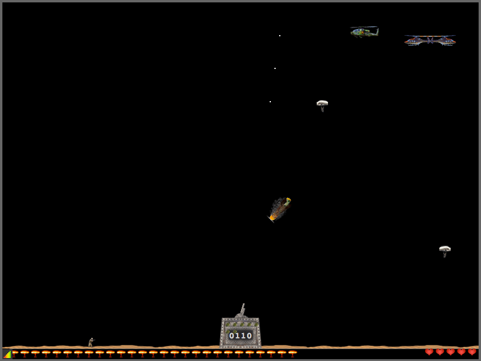

# Parattack Redux

An HTML and JavaScript-based single-player action game to play in the browser. Started in 2009 as my first major JS project, it's actually a remake of an Amiga game from 1993. The graphics are in fact directly lifted from that game. If you're the author of the original Parattack, please get in touch!

Play it and leave feedback on [Itch.io](https://mn3monic.itch.io/parattack-redux) or [raise an issue](https://github.com/mn113/hextension2/issues/) if it broke.

## Purpose

This repo is non-commercial and is provided as-is for no other purpose than entertainment, education and curiosity. Fork it, play with it, inspect it, but don't do anything that depends on it.

The game was created simply to learn something about using jQuery to move HTML elements around on a page, thereby creating the basis for a simple arcade game. If you would like to learn this kind of skill, feel free to explore and tinker with my code.

## Technologies used

* [jQuery](https://jquery.com/) - for easy DOM-manipulation and animations
* [Velocity.js](http://velocityjs.org/) - for better animation performance

## Installing

There's no real installation. Just download/clone the repo, and visit `index.html` in your browser.

## Game controls

You'll need a keyboard. One containing these keys: <kbd>&larr;</kbd> <kbd>&rarr;</kbd> <kbd>shift</kbd> <kbd>space</kbd> <kbd>z</kbd> <kbd>x</kbd>

## Project status

More or less completed, one or two issues outstanding, these may be addressed with time.

## Contributing

This project is not looking for contributions.

## License

This project is licensed under the MIT License.

## Acknowledgments

A. Kreibich (the creator of the original Parattack).
